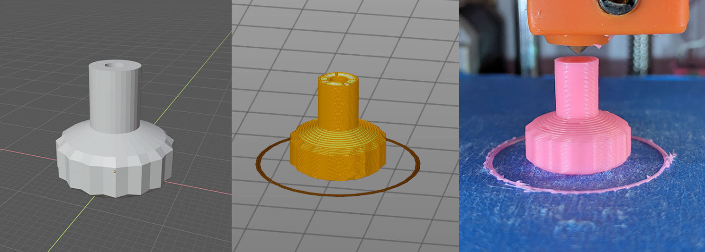
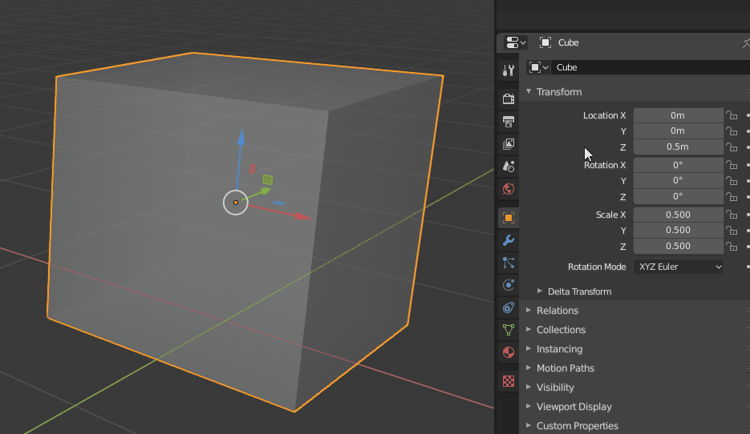
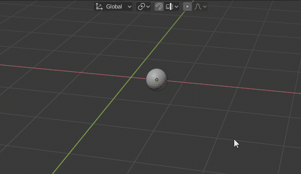
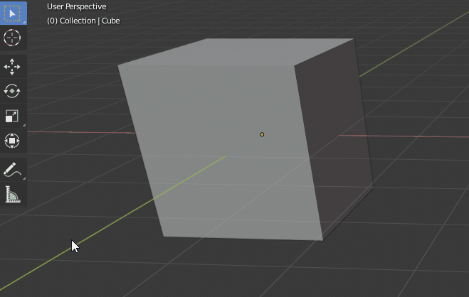
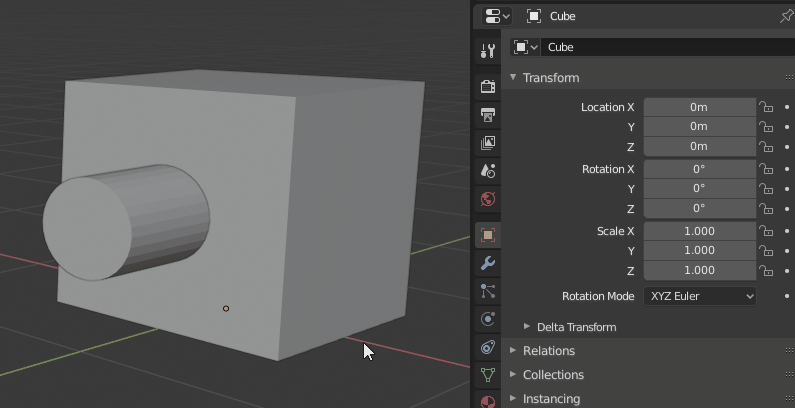
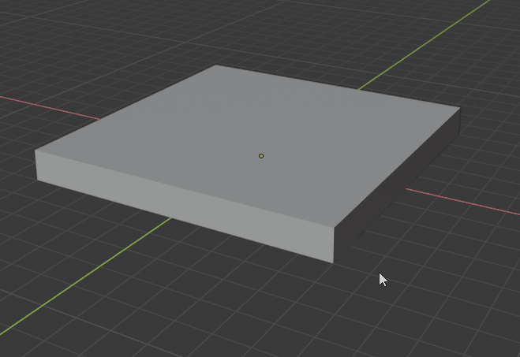
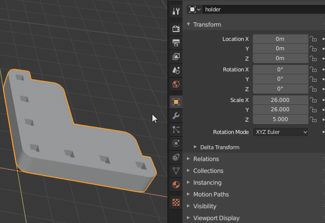

# 3d Printing with Blender 2.80

Materials for Boston Blender 3d printing meetup.

---

## Table of Contents

* [List of Files](#List-of-Files)
* [Shortcuts](#Shortcuts)
* [User Preferences](#User-Preferences)
* [3D Printing Software](#3D-Printing-Software)
* [Modeling](#Modeling)
  * [Apply Transformation](#Apply-Transformation)
  * [Grid Snapping](#Grid-Snapping)
  * [Measure Tool](#Measure-Tool)
  * [Boolean](#Boolean)
  * [Bevel](#Bevel)
  * [Wireframe Display](#Wireframe-Display)
---

## List of Files

| File Name | Description |
| --- | --- |
| **model/shapes.blend** | base meshes for modeling |
| **model/light_knob.blend** | light switch knob |
| **model/coat-hook.stl** | cubicle coat hook by [bharris555 from thingiverse](https://www.thingiverse.com/thing:3772435) |

---

## Shortcuts

For shortcuts please see the [Shortcuts section](https://github.com/lajos/boston-blender-character-modeling#Shortcuts) in the character modeling repo.

---

## User Preferences

For user preferences please see the [User Preferences section](https://github.com/lajos/boston-blender-character-modeling#User-Preferences) in the character modeling repo.

---

## 3D Printing Software

* **PrusaSlicer**: convert 3d models to gcode [www.prusa3d.com/prusaslicer/](https://www.prusa3d.com/prusaslicer/)
* **Printrun**: USB 3d printer control [www.pronterface.com/](http://www.pronterface.com/)
* **Octoprint**: web based 3d printer control [octoprint.org/](https://octoprint.org/)

---

## Modeling

### Apply Transformation

To reset an object's location/rotation to 0.0 or scale to 1.0, use the **Object/Apply** menu (**ctrl-A** shortcut):

### Grid Snapping

Grid snapping is very useful to move objects or components with precision. Toggle snapping with the **magnet** icon in the viewport (**shift-TAB** shortcut). In the snapping options menu (**ruler** icon next to **magnet**) there is an option whether to snap to the grid incrementally or absolutely.

### Measure Tool

The **measure tool** can measure distances and angles. Hold down **ctrl** to snap to vertices, **shift** to measure thickness. Drag anywhere on the line to activate angle measurement.

### Boolean

Combine meshes or cut parts out of a mesh using the **boolean modifier**:

* **difference**: subtract a mesh from another mesh (for example hole for a screw)
* **union**: add meshes togehter
* **intersect**: cut part of an mesh that intersects with another (opposite of **difference**)

Add the **boolean modifier** in the **modifier panel** (wrench icon). Select the the other object with the **eye dropper**. Select the desired operation (difference/union/intersect).

### Bevel

The **bevel** tool chamfers or rounds edges. In **edit mode** select the desired edges and activate the **Bevel Edges** tool from the **Edges** menu (**ctrl-B** shortcut). Set the  bevel size by moving the mouse, increase bevel resolution with the mouse wheel.

### Wireframe Display

Sometime it's useful to see the wireframe in object mode. Turn on **Wireframe** in the **Object** tab's **Viewport display** section.

